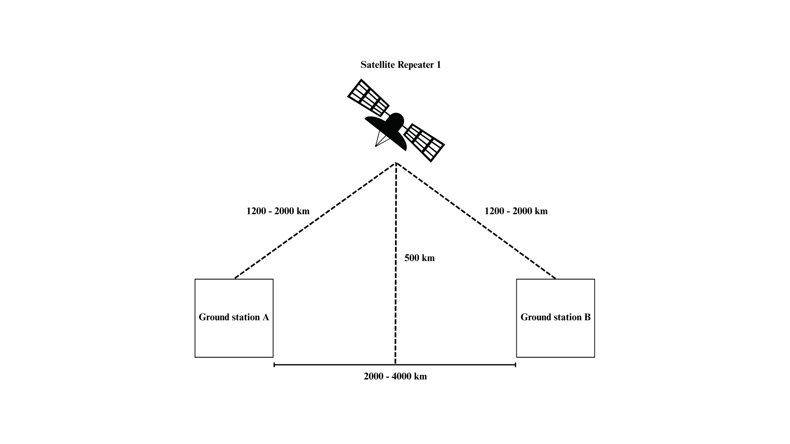
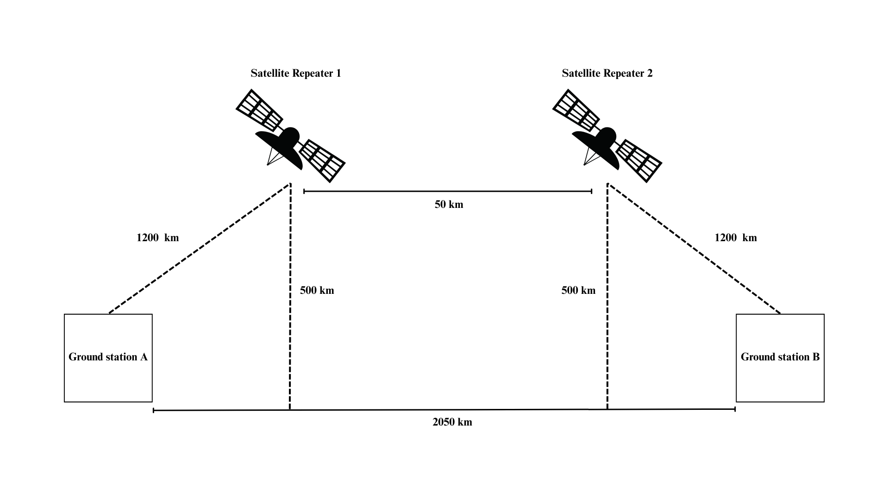
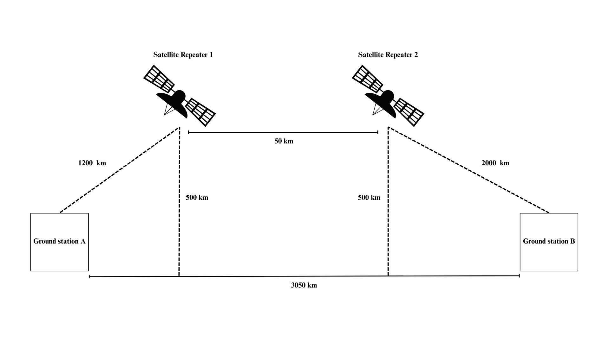

# Simulating a Quantum Network with Satellite Repeaters

## How to Run
Run sim.py to simulate the network and generate plots on entanglement fidelity and photon loss. 

## Network Architectures
### 1. Single Satellite Repeater
In this configuration, a satellite repeater was positioned equidistant between two ground stations. The total link length was varied, starting from 1200 km – comparable to the link length of the Micius satellite – and increased to 2000 km in segments of 200 km. At each step, fidelity and photon loss are calculated.

### 2. Two satellite repeaters with equal ground links
Here, both ground stations were connected to their respective satellite nodes via links of equal length. The distance between the two satellite repeaters was then varied, ranging from 50 to 2000 km. Fidelity and photon loss were evaluated at intermediate distances of 50, 100, 500, 1000 and 2000 km.

### 3. Two satellite repeaters with unequal ground links
To explore asymmetric configurations, I simulated a network in which the link between the second satellite repeater and its adjacent ground station was fixed at 2000 km, while the link from the first ground station to the first satellite remained at 1200 km. The distance between repeaters was again varied, following the same increments as in the previous setup.

